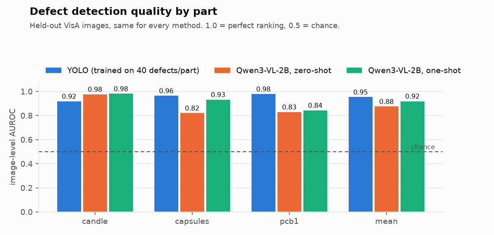
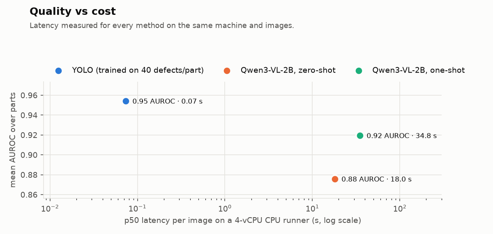
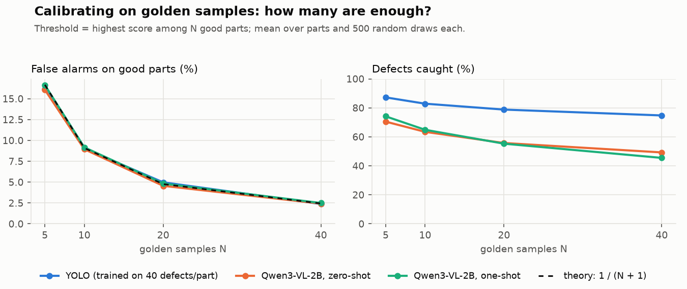

# vlm-inspect

**Industrial visual inspection with an open-weight vision-language model, measured against a
trained detector, and shipped as a production ML service.**

[](https://github.com/GBR-RL/vlm-inspect/actions/workflows/ci.yml)
[](https://github.com/GBR-RL/vlm-inspect/actions/workflows/benchmark.yml)


Vision-language models can inspect a part from a text description alone: *"an ultrasonic sensor
module; look for bent, melted or missing components and scratches"*. No labelled defects, no
training. That is a strong promise for production lines, where defect data is scarce and new
defect types keep appearing. This repository measures what the promise is worth. An open-weight
VLM (**Qwen3-VL-2B**, zero-shot and one-shot) is compared with a **YOLO detector trained on
labelled defects**, on the same held-out industrial images, together with the latency each costs
on a CPU. Around the models sits the engineering that production needs: an inspection API with
PostgreSQL, calibrated operating points, reports grounded in inspection specifications (RAG over
pgvector), containers and CI.

<picture>
  <source media="(prefers-color-scheme: dark)" srcset="docs/assets/auroc_by_part-dark.png">
  
</picture>

## Results

All numbers come from one run of the [Benchmark workflow](.github/workflows/benchmark.yml) on
GitHub-hosted runners, and latency was measured for every method on the same machine (AMD EPYC
9V74, 4 vCPU, CPU only). The protocol was fixed in [docs/EVAL_PROTOCOL.md](docs/EVAL_PROTOCOL.md)
before any result existed: [VisA](https://registry.opendata.aws/visa/) parts `pcb1`, `candle` and
`capsules`, 410 held-out images (150 defective, 260 good), the same images for every method.

| Method | Needs | Mean AUROC | Defects caught at ≤ 3 % false alarms | Box on the defect | Latency p50 | Memory |
|---|---|---:|---:|---:|---:|---:|
| **YOLO11n**, trained | 40 labelled defects per part | **0.954** | **73 %** | **71 %** | **0.07 s** | 0.5 GB |
| **Qwen3-VL-2B**, zero-shot | a text description | 0.876 | 51 % | 28 % | 18 s | 12.4 GB |
| **Qwen3-VL-2B**, one-shot | the same + one good reference image | 0.920 | 41 % | 23 % | 35 s | 12.4 GB |

"Defects caught" is recall at each method's operating threshold, calibrated for every method in
the same way on 20 defect-free "golden samples" per part (no defect labels). "Box on the defect"
means a predicted box overlaps a ground-truth defect with IoU ≥ 0.1. Per-part numbers:
[docs/benchmark_report.md](docs/benchmark_report.md).

<picture>
  <source media="(prefers-color-scheme: dark)" srcset="docs/assets/quality_vs_latency-dark.png">
  
</picture>

### What the numbers say

1. **Without a single defect label, the VLM ranks defects well:** 0.88 AUROC zero-shot, 0.92 with
   one reference image. On candles it beats the trained detector (0.98 vs 0.92) and catches 76 %
   of defects against YOLO's 42 %. Candle defects are varied and each type is rare, which is
   exactly where 40 labels are too few and a text description is enough.
2. **Where labels exist, the trained detector wins clearly:** higher AUROC on PCBs and capsules,
   2-3× better localisation, and 250-500× lower latency on the same CPU.
3. **The VLM's weakness is calibration more than detection.** With a reference image it is
   overconfident: it gives even many good parts a 0.94-0.99 defect probability, so a threshold that
   keeps false alarms low leaves recall at 18-76 %. Its best achievable F1 (0.68-0.94) is far
   above its F1 at the calibrated threshold, so a small labelled validation set would help it more
   than a bigger model.
4. **The VLM localises objects, not defects.** It boxes the damaged candle or capsule rather than
   the chip or scratch, which scores as a miss under strict IoU. The "points at the defect" metric
   (defect centre inside a box ≤ 25 % of the image) credits it on candles (72 % zero-shot), but on
   small PCB and capsule defects it is mostly wrong.
5. **Practical reading:** use the VLM to triage new part types or new defect types while labels are
   being collected, and switch to a trained detector once they exist. On a CPU the VLM handles
   about 1-3 parts per minute, so it cannot run inline on a fast line.

The one-shot result was not tuned: prompts, the 768-px input size and the calibration rule were
fixed before the run. The prompts also use a simplified defect list rather than VisA's exact
taxonomy; aligning them is a planned follow-up experiment ([plan](docs/IMPLEMENTATION_PLAN.md)).

### Follow-up: how many golden samples does a threshold need?

The benchmark sets each threshold from 20 defect-free images. `vlm-inspect calibration-study`
re-thresholds the scores the benchmark already produced (no model runs): it draws N good parts at
random for calibration, measures false alarms on the good parts not drawn and recall on all
defects, and repeats that 500 times per part.

<picture>
  <source media="(prefers-color-scheme: dark)" srcset="docs/assets/calibration_study-dark.png">
  
</picture>

- **The false-alarm rate is set by N alone.** With "highest golden score" as the threshold, a new
  good part scores higher with probability 1/(N+1), whatever the model. All three methods sit on
  that curve: 16 % at N = 5, 9 % at 10, 5 % at 20, 2.4 % at 40. N is the knob for false alarms.
- **The model decides what that costs in recall.** Going from 5 to 40 golden samples costs YOLO
  12 points of recall and the VLM 21-29 points, because the VLM gives many good parts
  defect-like scores.
- **The VLM operating point is fragile.** At N = 20, the recall of one-shot on candles is
  83 ± 14 % across draws, and on PCBs 22 ± 14 %. The single benchmark draw (41 %) is one sample
  from that spread. A fitted threshold (mean + 2 sd of the logit) steadies it slightly (one-shot
  60 % at 5.3 % false alarms) but costs YOLO 17 points, so it is not a general fix.

## Inspection service

```bash
docker compose up --build            # API + PostgreSQL (pgvector); open http://localhost:8000/docs
```

| Endpoint | Purpose |
|---|---|
| `POST /inspect` | image + part + method → defect verdict, score, calibrated threshold, boxes; stored in PostgreSQL |
| `POST /inspections/{id}/report` | report grounded in the part's inspection specification (RAG) |
| `GET /inspections`, `GET /inspections/{id}[/report]` | history, filterable by part and result |
| `GET /parts`, `GET /health`, `GET /metrics` | catalogue, liveness + database check, Prometheus metrics |

- **Calibrated operating points:** the service loads the benchmark's golden-sample thresholds per
  method and part, so it flags parts at exactly the operating point that was evaluated.
- **Concurrency:** inference runs in the thread pool behind one lock per model, so health checks
  and history queries stay responsive while a VLM spends 20-90 s on an image.
- **Persistence:** SQLAlchemy 2 with Alembic migrations. A test applies the migrations and compares
  the result with the ORM models; it caught a `FLOAT` vs `DOUBLE PRECISION` drift on its first run.
- **Images:** the slim `api` target runs the stub inspector (CI, demos); the `full` target adds
  CPU PyTorch, Qwen3-VL and YOLO.

### Grounded reports (RAG)

Each part has an inspection specification (e.g. [data/specs/candle.md](data/specs/candle.md)): one
clause per defect class, each with a verdict rule. Reports cite clauses, and clause retrieval runs
on pgvector inside PostgreSQL.

| Retriever (36 labelled queries, [eval set](data/specs/retrieval_eval.jsonl)) | recall@1 | recall@3 |
|---|---:|---:|
| Lexical baseline (hashed unigrams + bigrams) | 0.78 | 0.92 |
| **all-MiniLM-L6-v2** embeddings | **0.89** | **0.97** |
| Lexical + semantic fusion | 0.89 | 0.94-0.97 |

Fusion was tested and did not help, so the plain semantic retriever is the default. The LLM report
writer only sees the retrieved clauses. Its verdict and citations are validated, and a report that
cites a clause it was not given is rejected and replaced by the deterministic rule-based report,
with the reason stored. A report can never cite a clause that does not exist.

## Engineering

- **CI on every push:** Ruff, strict mypy and 62 tests on Python 3.11 and 3.12, the API and
  migrations against a real PostgreSQL service, and a Docker Compose smoke test that inspects an
  image through the running stack.
- **Benchmark workflow:** golden-sample calibration → 18 parallel VLM shards (each resumable) →
  YOLO trained in CI → same-machine latency job → merged report and charts. It runs on free
  runners in about 3 hours.
- **Every rule was fixed before results:** [EVAL_PROTOCOL.md](docs/EVAL_PROTOCOL.md) records each
  change made after the 2-image smoke test and why it was made.

## Quick start (evaluation)

```bash
git clone https://github.com/GBR-RL/vlm-inspect && cd vlm-inspect
python -m venv .venv && source .venv/bin/activate    # Windows: .venv\Scripts\activate
pip install torch torchvision --index-url https://download.pytorch.org/whl/cpu
pip install -e ".[vlm,yolo,plots,dev]"

vlm-inspect data-prepare                              # VisA download (1.9 GB, once) + protocol
vlm-inspect eval --method qwen-zero -c candle --limit 20
vlm-inspect report                                    # tables + charts from results/
```

## Repository layout

| Path | Contents |
|---|---|
| `src/vlm_inspect/data/` | VisA download, evaluation protocol, mask → boxes, YOLO export |
| `src/vlm_inspect/inspectors/` | `QwenVLInspector`, `YoloInspector`, `StubInspector` behind one interface |
| `src/vlm_inspect/eval/` | metrics, calibration, resumable sharded runner, report and charts |
| `src/vlm_inspect/api/` | FastAPI service, SQLAlchemy models, pgvector clause index |
| `src/vlm_inspect/rag/` | specification parsing, embeddings, retrieval, validated report writers |
| `data/specs/`, `data/protocol.jsonl` | inspection specifications, retrieval eval set, the exact image split |
| `migrations/`, `Dockerfile`, `compose.yaml` | Alembic migrations, container images, local stack |
| `docs/` | [plan](docs/IMPLEMENTATION_PLAN.md), [protocol](docs/EVAL_PROTOCOL.md), [benchmark report](docs/benchmark_report.md) |

## Data and licences

VisA: Amazon, [CC BY 4.0](https://registry.opendata.aws/visa/) (Zou et al., *SPot-the-Difference
Self-Supervised Pre-training for Anomaly Detection and Segmentation*, ECCV 2022). Qwen3-VL: Apache
2.0. all-MiniLM-L6-v2: Apache 2.0. Ultralytics YOLO: AGPL-3.0. Data and weights are downloaded at
run time and never committed. Code in this repository: MIT.
