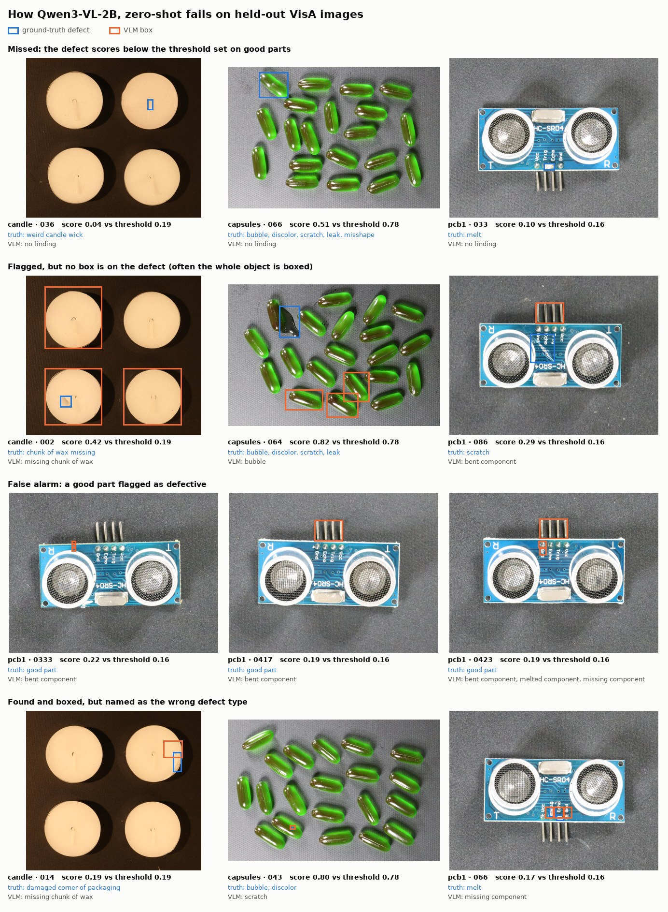

# Follow-up experiments

Three questions left open by the [first benchmark](benchmark_report.md) (Benchmark run
36111413426). Each one reuses that run's scores or findings where possible, so only the prompt
experiment needed new model runs. All runs used free GitHub-hosted runners.

## 1. How many golden samples does a threshold need?

`vlm-inspect calibration-study --results-dir <benchmark results>` (no model runs). For every method
and part, the good-part scores (20 golden samples plus the held-out good images) form a pool. Each
of 500 trials draws N of them to set the threshold, then measures false alarms on the good parts
not drawn and recall on all defects. Numbers are means over parts.

| Method | N = 5 | N = 10 | N = 20 | N = 40 |
|---|---:|---:|---:|---:|
| False alarms, any method (max-of-N rule) | 16 % | 9 % | 5 % | 2.4 % |
| Theory: 1 / (N + 1) | 16.7 % | 9.1 % | 4.8 % | 2.4 % |
| Recall, YOLO | 87 % | 83 % | 79 % | 75 % |
| Recall, Qwen3-VL zero-shot | 70 % | 63 % | 56 % | 49 % |
| Recall, Qwen3-VL one-shot | 74 % | 65 % | 55 % | 45 % |

- With "highest golden score" as the threshold, the chance that a new good part scores higher
  is 1/(N+1) for any continuous score (order statistics). Every model follows it closely, so N
  alone sets the false-alarm rate.
- What the model decides is the recall that rate costs. Going from N = 5 to 40 costs YOLO 12
  points and the VLM 21-29, because the VLM gives many good parts defect-like scores.
- Across draws at N = 20, per-part VLM recall varies widely: one-shot candle 83 ± 14 %, capsules
  60 ± 20 %, PCB 22 ± 14 %. The benchmark's 41 % one-shot recall is one draw from that spread.
- Other rules at N = 20: the benchmark's 95th percentile equals the maximum for N ≤ 20. A
  logit-Gaussian rule (mean + 2 sd of logit(score)) gives one-shot 60 % recall at 5.3 % false
  alarms, but cuts YOLO to 62 %, so it is not a general improvement.

## 2. Exact defect names in the prompt (prompt v2)

The first benchmark prompted the VLM with a simplified defect list per part. Prompt v2 uses VisA's
own defect classes and a more precise part description (`src/vlm_inspect/parts.py`; PCB1 already
matched). The Benchmark workflow was re-run with `prompt_version=v2` on candle and capsules only
(run 36144593848, 1 h 23 min), and everything else was kept identical, including the golden
samples and the held-out images.

| Method, part | AUROC v1 → v2 | Recall v1 → v2 | Box on defect v1 → v2 | Report cites a true-defect clause v1 → v2 (chance) |
|---|---|---|---|---|
| zero-shot, candle | 0.977 → 0.980 | 76 → 76 % | 42 → 48 % | **18 → 39 %** (19 → 21 %) |
| zero-shot, capsules | 0.821 → 0.804 | 36 → 38 % | 18 → 18 % | 94 → 95 % (79 → 72 %) |
| one-shot, candle | 0.982 → 0.980 | 76 → 76 % | 38 → 42 % | **18 → 42 %** (19 → 20 %) |
| one-shot, capsules | 0.933 → 0.926 | 30 → 28 % | 20 → 18 % | 93 → 100 % (85 → 90 %) |

"Report cites a true-defect clause" uses every correctly flagged defect (14-38 per cell), the
rule-based report writer and MiniLM retrieval (`vlm-inspect report-eval --no-llm`). *Chance* is
the rate for citing the same number of the part's defect clauses at random.

- **Detection is unchanged:** AUROC and recall move by at most 0.02 and 2 points. The defect score
  is P("Yes") to "is there a defect?", and the defect list barely moves it.
- **Naming improves a lot where it was wrong:** with v1 names, candle reports cited the right
  clause at chance level (18 % vs 19 %). The VLM said "discoloration" or "abnormal wick", and
  retrieval mapped those to the wrong clauses. With VisA's names it is twice chance. PCB reports
  under v1 were also at chance (29 % vs 32 % zero-shot).
- **Capsules are easy to ground by chance:** a capsule image shows about 25 capsules, and 28 of
  the 100 defect images carry all five defect classes, so almost any clause is "right". The
  baseline column is there for this reason.
- The service now defaults to v2 (`VLM_INSPECT_VLM_PROMPT_VERSION`). The headline benchmark stays
  on v1 for reproducibility.

## 3. Rule-based vs LLM-written reports on real findings

`experiments.yml` (run 36144598218) took 10 correctly flagged defects per part from the v1
benchmark (30 zero-shot, 29 one-shot; one had no mappable VisA class). For each one it wrote a
report with the deterministic rule writer and with Qwen3-VL-2B as the writer, on the same
retrieved clauses. Each report is scored against VisA's ground-truth classes.

| Findings from | Writer | Cites a true-defect clause (chance) | Verdict as the spec prescribes | Valid output | Time per report |
|---|---|---:|---:|---:|---:|
| zero-shot | rules | 50 % (44 %) | 80 % | always | < 0.1 s |
| zero-shot | LLM | 50 % (45 %) | 80 % | 90 % | 40 s |
| one-shot | rules | 55 % (48 %) | 72 % | always | < 0.1 s |
| one-shot | LLM | 52 % (49 %) | 90 % | 100 % | 44 s |

- **The writer is not the bottleneck.** Both writers only see the clauses retrieved for the VLM's
  own finding labels, so when the VLM names the wrong defect, neither can cite the right clause.
  Grounding is close to chance for both, and prompt v2 (above) is what moves it.
- The LLM writer chose the prescribed verdict more often on one-shot findings (90 % vs 72 %, a
  difference of 5 reports out of 29). This is a small sample.
- Validation worked as designed. Three zero-shot LLM outputs were rejected (2 not valid JSON,
  1 citing a clause it was not given) and replaced by the rule report. No invalid citation reached
  a stored report.
- At 40 s per report on a CPU, the LLM writer is an opt-in (`VLM_INSPECT_REPORT_WRITER=llm`); rules
  stay the default.

## 4. Failure gallery

`vlm-inspect gallery --report-eval <report-eval json>` draws the zero-shot VLM's failure modes on
the held-out images. Cases are chosen by fixed rules (lowest-scoring misses, largest wrong boxes,
highest-scoring false alarms, ungrounded reports on correctly boxed defects), interleaved over
parts. See `src/vlm_inspect/eval/gallery.py`.



Images: VisA (Zou et al., ECCV 2022), CC BY 4.0, resized and annotated.

## Reproduce

```bash
# 1. calibration study, from the Benchmark run's artifacts
gh run download 36111413426 -p "results-*" -D results && gh run download 36111413426 -p "calibration-*" -D results
# (merge the per-artifact folders into results/<method>/<part>/ first)
vlm-inspect calibration-study --results-dir results

# 2. prompt v2: Actions → Benchmark → prompt_version=v2, categories=["candle","capsules"], run_yolo=false
# 3. report quality: Actions → Experiments → benchmark_run_id=36111413426
vlm-inspect report-eval --method qwen-zero --results-dir results --per-part 50 --no-llm
# 4. gallery
vlm-inspect gallery --results-dir results --report-eval results/report-eval/qwen-zero.json
```
